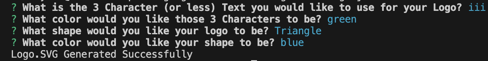

<h1 id="title">ReadMe file for "A Unique Logo Generator"</h1>
<h3>By User davehyler</h3>
<!-- Optional Screenshot will show if user places one within the same directory as this readme. -->

 
<nav>
<h2>Table Of Contents</h2>
<ol>
<li><a href="#title">Title</a></li>
<li><a href="#username">Username</a></li>
<li><a href="#email">Email</a></li>
<li><a href="#stack">Stack</a></li>
<li><a href="#license">License</a></li>
<li><a href="#description">Description</a></li>
<li><a href="#instructions">Installation Instructions</a></li>
<li><a href="#usage">Usage</a></li>
<li><a href="#guidelines">Guidelines</a></li>
<li><a href="#testing">Testing</a></li>
</ol>
</nav>
<ul class="list-group">
<h2>Project Information</h2>
<h3 id="stack">Stack used:</h3>

<h3 id="license">License: MIT</h3>

Badge: 

<h3 id="description">Description of project:</h3>

A simple node based script that will generate a vector graphics file of either a circle, triangle, or square along with 3 Characters of your choosing, both assets of which can be colored using any accepted color input (ie; "blue").

<h3 id="instructions">Installation Instructions:</h3>

Make sure to install any dependancies (see package.json in same directory) prior to attempting to run, then within your terminal running within the directory of "generatelogo.js", type the command "node generatelogo.js" to begin and follow the prompts.

<h3 id="usage">How to use:</h3>

Available for any use where a 3 Character Logo built with vector graphics is needed.

<h3 id="guidelines">Guidelines for Contribution:</h3>

Make sure all submissions are compatible with the current codebase.

<h3 id="testing">Tests</h3>

Make sure to install "jest" prior to testing the shape.

</ul>
<h3>Questions? Contact Me:</h3>
<ul class="list-group">
<li class="list-group-item">GitHub username: davehyler</li>
<li class="list-group-item">Email:  davehyler@github.com (placeholder, do not use. Will not post personal information on assignments present on publicly scrapable websites)</li>
</ul>
